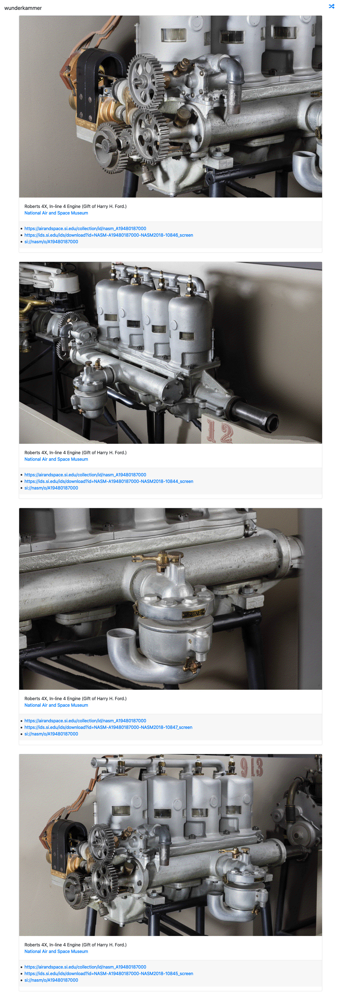

# go-wunderkammer-www



## Important

Work in progress

## Tools

To build binary versions of these tools run the `cli` Makefile target. For example:

```
$> make cli
go build -mod vendor -o bin/wunderkammer-server cmd/wunderkammer-server/main.go
```

### wunderkammer-server

```
$> ./bin/wunderkammer-server -h
Usage of ./bin/wunderkammer-server:
  -database-dsn string
    	A valid wunderkammer database DSN string. (default "sql://sqlite3/oembed.db")
  -path-templates string
    	The path to valid wunderkammer-www HTML templates. (default "static/templates/html/*")
  -server-uri string
    	A valid aaronland/go-http-server URI. (default "http://localhost:8080")
```

For example:

```
$> sqlite3 /usr/local/go-wunderkammer/nasm.db < /usr/local/go-wunderkammer/schema/sqlite/oembed.sql

$> /usr/local/go-smithsonian-openaccess/bin/emit \
	-oembed \
	-bucket-uri file:///Users/asc/code/OpenAccess metadata/objects/NASM \

   | /usr/local/go-wunderkammer-image/bin/append-dataurl \
	-timings \
	-dither \

   | /usr/local/go-wunderkammer/bin/wunderkammer-db \
	-database-dsn 'sql://sqlite3/usr/local/go-wunderkammer/nasm.db'

...time passes

$> /usr/local/go-wunderkammer-www/bin/wunderkammer-server \
	-database-dsn 'sql://sqlite3/usr/local/go-wunderkammer/nasm.db'
```

## See also

* https://github.com/search?q=topic%3Awunderkammer+org%3Aaaronland&type=Repositories
* https://github.com/aaronland/go-http-server
* https://github.com/aaronland/go-http-bootstrap